# Enveda CASMI 2026 — Exploratory Data Analysis

**Data:** `train.parquet` (2,539,608 spectra), the placeholder `test.parquet` (1,213 spectra, 400 molecules) and `sample_submission.csv`.
**Reproduce:** `PYTHONPATH=src python scripts/eda/0{1,2,3,4}_*.py`. Figures are in [`figures/`](figures) and every number quoted here is in [`stats/`](stats).
The report contains only aggregate statistics. The competition rules forbid redistributing the raw data.

---

## TL;DR: what matters for modelling

1. **The downloadable `test.parquet` is not a validation set.** All 1,213 of its spectra are exact copies of `enveda-180` rows: synthetic, drug-like, 100% nitrogen-containing screening compounds. The hidden test set is natural-product-like. 34.5% of placeholder spectra also still contain peaks above precursor + 2 Da, which the hidden test set has had removed. **Build local validation from `enveda-np-examples` instead,** or from natural-product structures held out of the public libraries.
2. **Instrument match and chemistry match pull in opposite directions.** `enveda-180` (45% of the spectra) uses the test instrument (timsTOF) but the wrong chemistry. Its median NP-likeness is −1.49, against +1.42 for the test-like `enveda-np-examples`. Its nearest-neighbour Tanimoto to those examples is only 0.28. The public libraries have the right chemistry (nearest analog Tanimoto 0.78) on the wrong instruments.
3. **Plain library search works well for class 1, given a clean candidate list.** On the 250 timsTOF natural products, a 10 ppm neutral-mass filter plus binned cosine against public reference spectra gives **MRR@25 = 0.898** (82.8% top-1, 98.4% top-5). Random order within the same mass window gives 0.307. This is optimistic: the candidate pool is only the training structures (median 13 per window), while a PubChem/COCONUT pool for classes 2 and 3 will be far larger.
4. **Same-compound spectra transfer across high-resolution instruments.** The best cosine between a timsTOF query and the same molecule is about 0.88 on Orbitrap and 0.86 on Q-TOF, but near zero on ion-trap and triple-quad references. Restrict reference libraries to high-resolution spectra.
5. **Label quality differs a lot by library, and `precursor_error_ppm` can mislead.** Large errors are discrete mass offsets: adduct mislabels in GNPS, MassBank and RIKEN (+1.007, +17.03, +18.01, +21.98 Da), and nominal-mass precursors. But in `pluskal_ms2`, **all 50,785 `[M+CH2O2-H]-` spectra show a 1.007 Da "error" even though their precursors are correct** (precursor − M = 44.998 Da exactly). The ppm column is wrong there, not the label. Filtering on `|ppm| > 10` would wrongly drop about 10% of MSnLib.
6. **Peak lists are on very different footings.** timsTOF spectra have a median of about 140 peaks, of which about 75% are below 0.1% of the base peak. Most public libraries are pre-thresholded and have a median of 9–57 peaks. Several libraries round m/z to 2 decimals (MS-DIAL 34%, MassBank 10%). Apply a common pipeline to everything: drop peaks above precursor + 2 Da, apply an intensity floor, keep the top N, and sqrt-scale.
7. **Collision energy strongly shapes timsTOF spectra.** For `enveda-180` `[M+H]+`, the precursor peak is present in 98% of spectra at 20 eV, 54% at 40 eV and 5% at 60 eV, and the median base-peak position (fraction of the precursor m/z) falls from 0.58 to 0.37. The test set has 20/40/60 eV spectra plus merged multi-energy ones (25%), and 1–16 spectra per molecule. **Aggregating across a molecule's spectra is essential.**
8. **Natural-product fragmentation leaves recognisable fingerprints.** Compared with enveda-180, np-examples spectra show 3× more H₂O losses, 28× more 2·H₂O losses, 10× more hexose (162.053) losses, and 6–7× more deoxyhexose and pentose losses. These are cheap, interpretable features, for example for a glycoside or compound-class prior.

---

## 1. Task and evaluation recap

* Predict up to 25 ranked SMILES per `molecule_id` (spectra must be aggregated per molecule). The metric is **MRR@25**, and a guess counts as correct when its **InChIKey first block** matches, after RDKit tautomer canonicalisation. Stereochemistry is ignored. Every training SMILES is already stereo-free, and the provided `inchikey14` matches a recomputed one in all libraries checked.
* The hidden test set has about 1,500 timsTOF spectra of about 400 molecules, with masses from 157 to 1,159 Da. Its three novelty classes (in public spectra, in PubChem/COCONUT only, or novel) are mixed in unknown proportions.
* Submissions run in a notebook: at most 9 h, no internet. Every external resource (reference libraries, candidate databases, pretrained models) has to be packaged as a Kaggle dataset.

## 2. Library composition and overlap

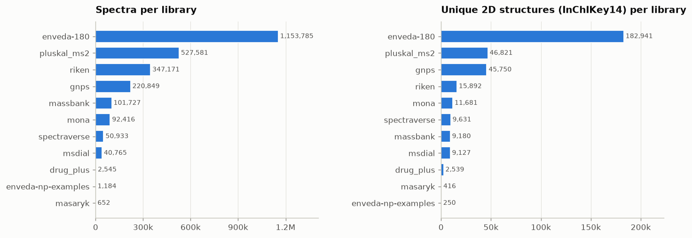

| library | spectra | structures | spectra / structure |
|---|---:|---:|---:|
| enveda-180 | 1,153,785 | 182,941 | 6.3 |
| pluskal_ms2 | 527,581 | 46,821 | 11.3 |
| riken | 347,171 | 15,892 | 21.8 |
| gnps | 220,849 | 45,750 | 4.8 |
| massbank | 101,727 | 9,180 | 11.1 |
| mona | 92,416 | 11,681 | 7.9 |
| spectraverse | 50,933 | 9,631 | 5.3 |
| msdial | 40,765 | 9,127 | 4.5 |
| drug_plus | 2,545 | 2,539 | 1.0 |
| enveda-np-examples | 1,184 | 250 | 4.7 |
| masaryk | 652 | 416 | 1.6 |

There are 275,810 unique 2D structures in total. **90% of them occur in only one library.** The median structure has 6 spectra and the 99th percentile has 79, with a maximum of 1,468.

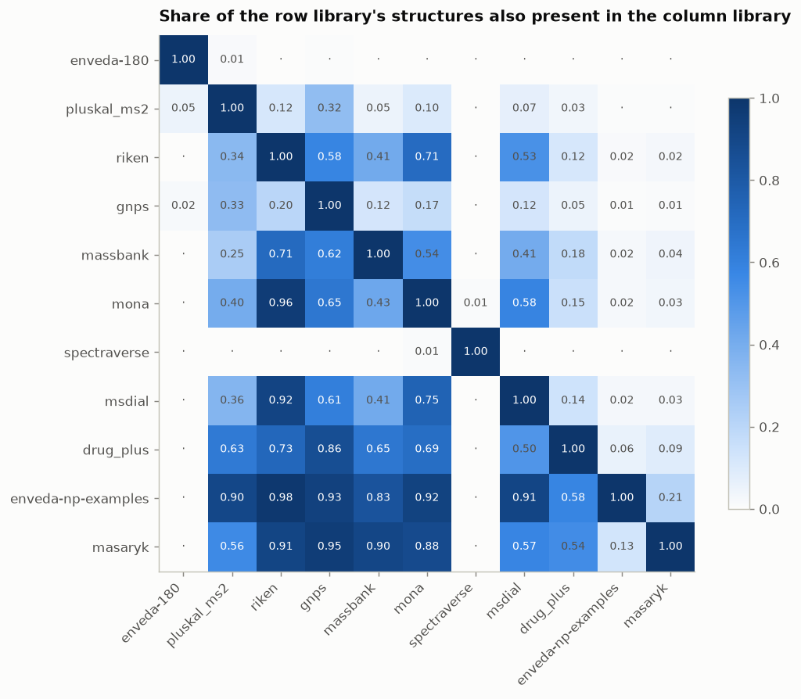

* `enveda-180` is almost disjoint from everything else: 98.7% of its structures appear nowhere else. **None of the 250 `enveda-np-examples` structures are in enveda-180, but every one of them is in the public libraries** (98% in RIKEN, 93% in GNPS).
* `spectraverse` looks 99% exclusive, but its formulas overlap 49% with the other libraries. Exact duplicate spectra were credited to the primary source, so only spectraverse's unique compounds remain.
* `masaryk` and `drug_plus` are small and mostly redundant.

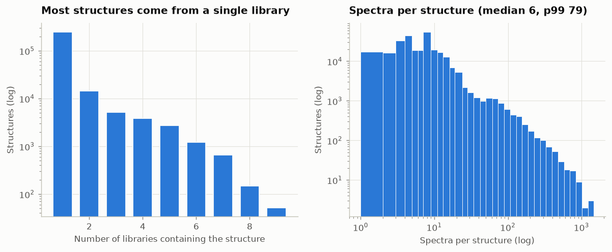

Grouping train spectra by (library, structure), as the test groups them by `molecule_id`, gives a median of 4 spectra for np-examples and 3 for the test placeholder. Both match the hidden test's median of 3.

## 3. Adducts and ionisation

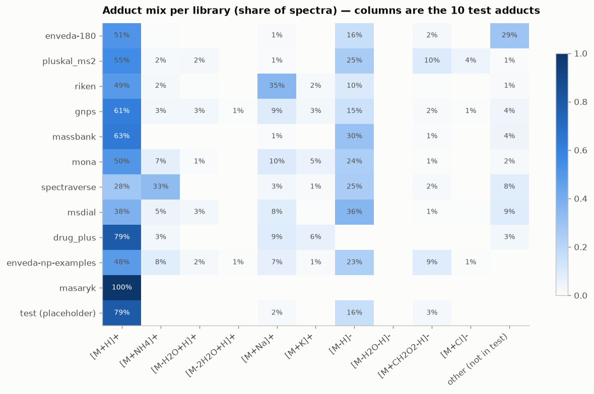

* The training set has **121 adduct types**. 85.7% of spectra use one of the 10 test adducts.
* **29% of enveda-180 is dimer adducts** (`[2M+Na]+` 188k, `[2M+H]+` 89k, `[2M-H]-` 53k), which never occur in the test set. Their fragmentation is dominated by the monomer ion at about half the precursor m/z. That is the sharp spike at 0.5 in figure 11. Down-weight or drop them, or use them only for pretraining.
* RIKEN is 35% `[M+Na]+`, and spectraverse is 33% `[M+NH4]+`. The test placeholder is 79% `[M+H]+` and 16% `[M-H]-`. The hidden test adds `[M+CH2O2-H]-`, `[M+NH4]+`, `[M-H2O+H]+` and others, and np-examples (23% `[M-H]-`, 9% formate) suggests a richer negative-mode share.
* Negative-mode share: 33% for np-examples, 23% for enveda-180, 19% for the placeholder.

## 4. Instruments

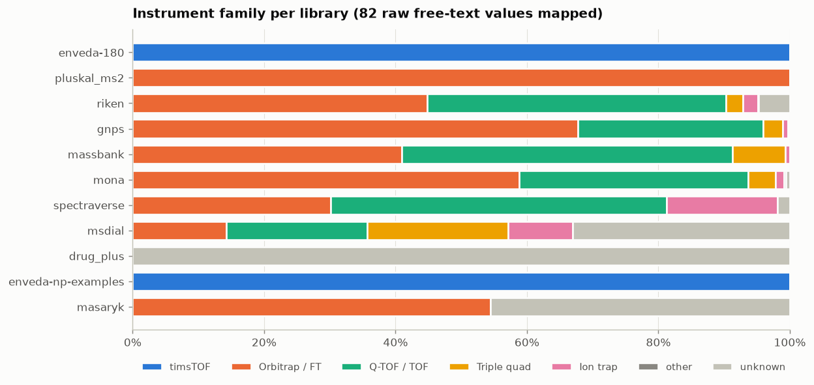

The 82 free-text `instrument_type` strings were mapped to families with [`casmi.meta.instrument_family`](../../src/casmi/meta.py); the raw values and their mapping are in `stats/instrument_type_raw_values.csv`. Only enveda-180 and enveda-np-examples are timsTOF. MS-DIAL has a sizeable triple-quad and ion-trap share. drug_plus has no instrument metadata.

## 5. Collision energy

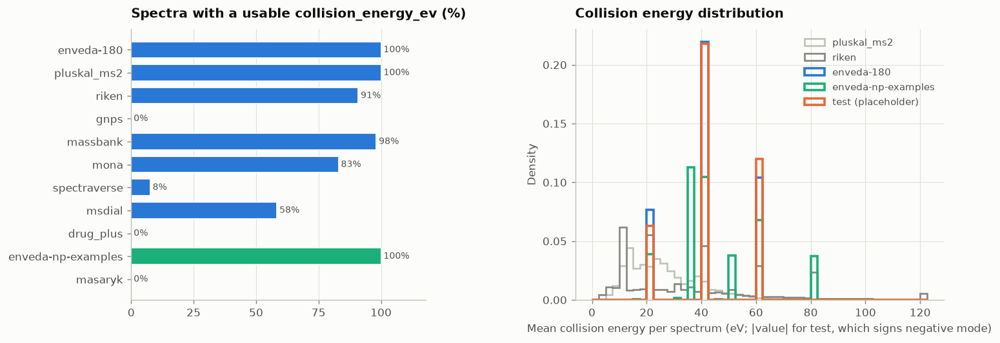

* Units: enveda-180 and np-examples are eV; MSnLib (`pluskal_ms2`) is 100% NCE, converted approximately. **GNPS, drug_plus and masaryk have no collision energy at all**, and spectraverse has it for only 8%.
* The test placeholder uses 20/40/60 eV and merged `20,40,60`. **Negative-mode energies are stored with a minus sign** (`-40`, `-60,-40,-20`), so take the absolute value. np-examples additionally uses 35, 50 and 80 eV and merged `20;50`, `20;40;60;80` and `0;20;40;60;80`.
* About 27% of enveda-180 and 35% of np-examples spectra are merged multi-energy spectra (`ce_n > 1`).

## 6. Precursor-mass error and label quality

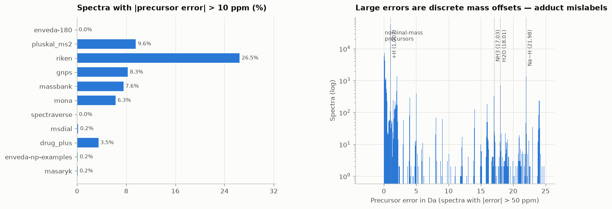

| library | median abs. ppm | share > 10 ppm |
|---|---:|---:|
| enveda-180 | 0.98 | 0.0% |
| spectraverse | 0.65 | 0.05% |
| enveda-np-examples | 1.65 | 0.17% |
| msdial | 1.47 | 0.24% |
| mona | 1.80 | 6.3% |
| massbank | 1.95 | 7.6% |
| gnps | 1.67 | 8.3% |
| pluskal_ms2 | 1.66 | 9.6% *(all formate artefact)* |
| riken | 3.75 | 26.5% |

Spectra with errors above 50 ppm cluster at **discrete offsets**: +1.007 Da (a wrong H, e.g. `[M]+` vs `[M+H]+`), +17.03 (NH₃), +18.01 (H₂O), +21.98 (Na vs H), plus a 0–0.1 Da smear from nominal-mass precursors in MassBank, MoNA and RIKEN. These are adduct or precursor mislabels, not random noise, and many are recoverable by re-assigning the adduct. The one exception is the `pluskal_ms2` formate set described in the TL;DR, where the label is right and the error column is wrong.

## 7. Precursor m/z and peak counts

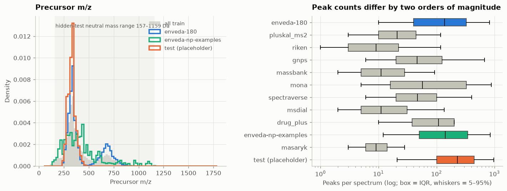

* Precursor m/z for enveda-180 is concentrated at 250–400 (median mass 330), plus a second mode around 650 from dimer adducts. np-examples spread from 150 to 1,100, in line with the hidden test's 157–1,159 Da.
* Median peaks per spectrum: enveda-180 138, np-examples 142, placeholder 230, GNPS 46, MoNA 57, pluskal 21, RIKEN 9, MassBank 11, MS-DIAL 11. The tail runs to 73k peaks (GNPS).

## 8. Peak-level statistics

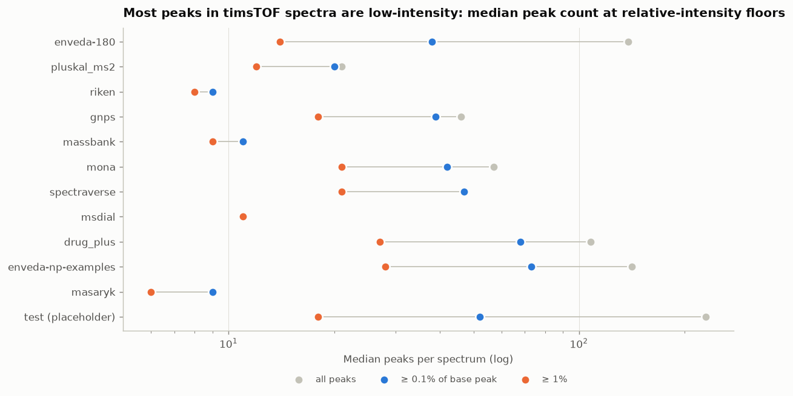

* **About 75% of timsTOF peaks are below 0.1% of the base peak** (enveda-180 75%, placeholder 77%, np-examples 46%). Most public libraries ship pre-thresholded spectra with essentially no peaks below 0.1%. A 1% floor brings everything to a comparable 8–28 median peaks.
* With a 1% floor, the share of spectra left with fewer than 6 peaks is 5% for np-examples, 14% for enveda-180 and 39% for RIKEN.

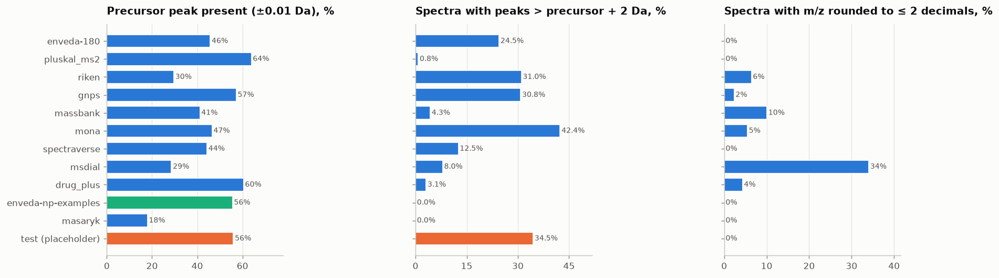

* The precursor peak (±0.01 Da) is present in 18–64% of spectra (RIKEN 30%, MS-DIAL 29%, masaryk 18%, others 41–64%).
* **Peaks above precursor + 2 Da** occur in 24.5% of enveda-180, 34.5% of the placeholder, 42% of MoNA and 31% of GNPS and RIKEN, **but 0% of np-examples**, which went through the test pipeline. Remove them everywhere to match the hidden test.
* Low-precision m/z (≤ 2 decimals): MS-DIAL 34%, MassBank 10%, RIKEN 6%. Use tolerance-based matching (about 0.01 Da or 10–20 ppm) rather than exact bins when these libraries serve as references.
* The ¹³C isotope peak (+1.00336 Da) is present for about 15% of timsTOF peaks (median per spectrum), against 0% in most public libraries (GNPS 3.5%, MoNA 6%, drug_plus 10%), which were mostly shipped deisotoped. Deisotope timsTOF spectra for consistency.
* No NaN, zero or negative intensities, and no unsorted m/z arrays, in any library.

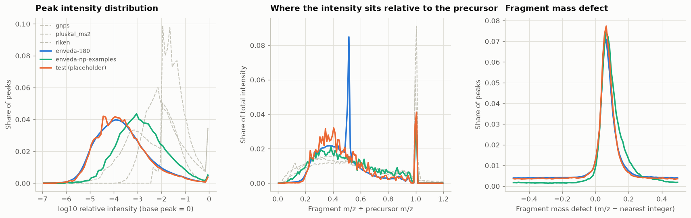

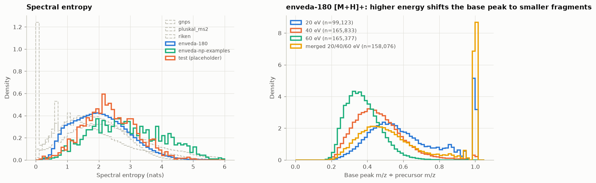

Spectral entropy is higher for np-examples (median 2.79 nats) than for enveda-180 (2.00): natural products spread their intensity over more fragments. In enveda-180 `[M+H]+`, energy changes everything:

| CE | precursor peak present | median base-peak m/z ÷ precursor | median entropy |
|---|---:|---:|---:|
| 20 eV | 98% | 0.58 | 1.85 |
| 40 eV | 54% | 0.45 | 2.36 |
| 60 eV | 5% | 0.37 | 2.77 |
| merged 20/40/60 | 98% | 0.55 | 2.60 |

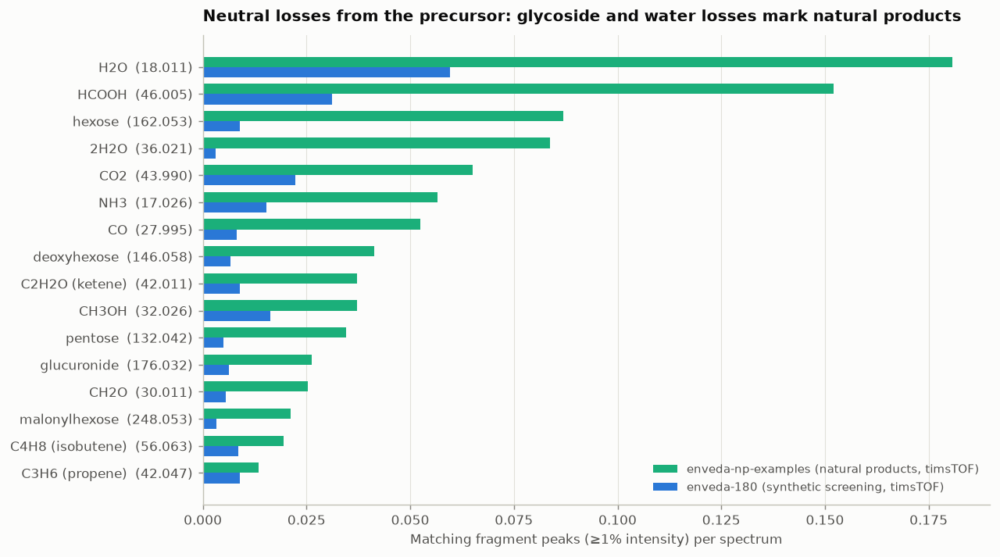

Neutral losses from the precursor (fragments at ≥ 1% intensity, ±7.5 mDa) separate the two chemistries. In np-examples the most frequent are H₂O, HCOOH (from formate adducts), hexose, 2·H₂O, CO₂, NH₃, CO and deoxyhexose. The sugar losses are 6–10× more frequent than in enveda-180, and 2·H₂O is 28× more frequent. The full table across libraries is `stats/neutral_loss_rates.csv`.

## 9. Chemistry of the labels

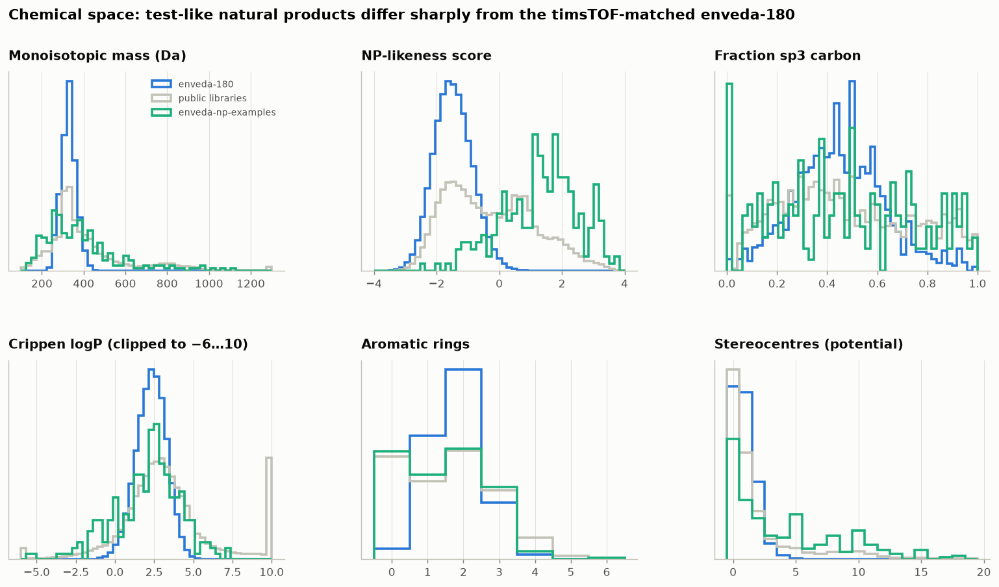

| median | enveda-180 | public libraries | np-examples |
|---|---:|---:|---:|
| monoisotopic mass | 330 | 349 | 354 |
| NP-likeness (Ertl) | **−1.49** | −0.41 | **+1.42** |
| potential stereocentres | 1 | 1 | 3 |
| O atoms | 2 | 3 | 5 |
| N atoms | 3 | 2 | 0 |
| TPSA | 67 | 76 | 87 |

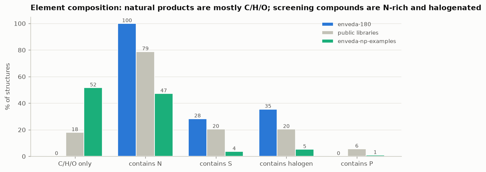

**Every enveda-180 structure contains nitrogen (0% are C/H/O only)**, and 35% are halogenated. Among np-examples, 52% are C/H/O only and 5% halogenated. A formula predictor or decoder trained mostly on enveda-180 will have a strong N/halogen bias that the test set punishes.

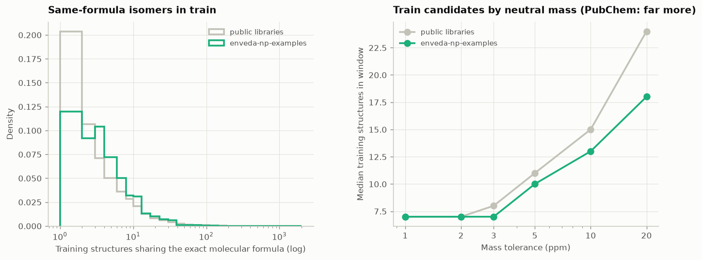

* Only 9% of training structures have a formula unique within train. An np-example shares its exact formula with a median of 6 training structures.
* Within ±10 ppm of its neutral mass, an np-example has a median of 13 training candidates (7 at ±2 ppm). These are training structures only; PubChem typically has hundreds to thousands of isomers per natural-product formula, which is what classes 2 and 3 face.

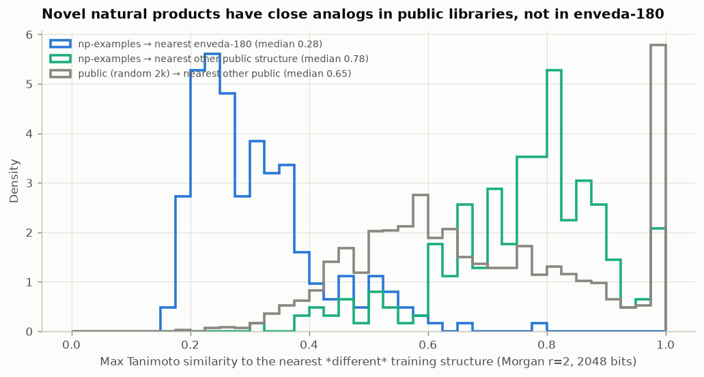

| query → pool | median max Tanimoto | 90th pct |
|---|---:|---:|
| np-examples → enveda-180 | 0.28 | 0.46 |
| np-examples → other public structures | 0.78 | 0.91 |
| random public → other public | 0.65 | 1.00 |

74% of np-examples have a public analog with Tanimoto ≥ 0.7. Analog-based ranking and generative approaches should draw on the public natural-product libraries, not on enveda-180.

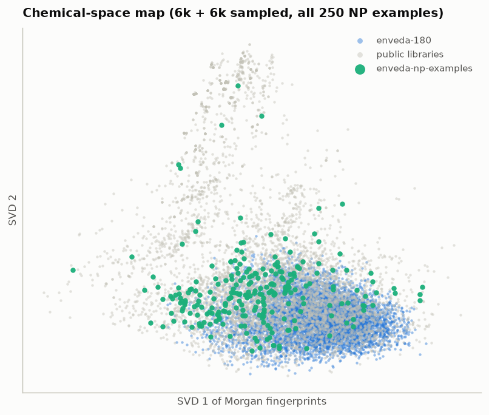

## 10. Library-search baseline (class 1 proxy)

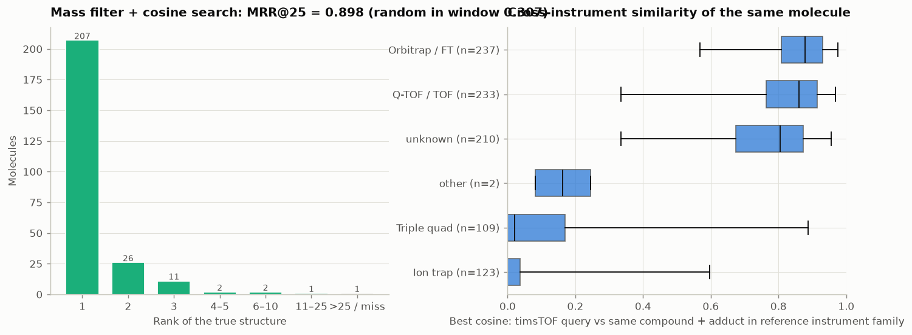

Setup (`scripts/eda/04_library_search.py`):

1. The 250 np-examples molecules (1,184 spectra) are the queries, grouped by structure like test molecules.
2. The neutral mass is computed from the precursor and adduct, and the candidates are every training structure within 10 ppm. The true structure is always among them.
3. Each spectrum is cleaned: peaks above precursor + 2 Da are dropped, the floor is 1%, the top 64 peaks are kept and sqrt-scaled.
4. Spectra are binned at 0.01 Da and compared by cosine against 150k reference spectra from all other libraries in the same ionisation mode.
5. A candidate's score is its best cosine over all of the molecule's spectra.

| metric | value |
|---|---:|
| MRR@25 | **0.898** |
| top-1 / top-5 / top-25 | 82.8% / 98.4% / 99.6% |
| random order within the mass window | 0.307 |
| candidates per molecule (median / p75 / max) | 13 / 34 / 227 |

Caveats: (a) the candidate pool is training structures only. Adding PubChem/COCONUT candidates, needed for class 2, will add many no-spectrum isomers that cosine search cannot rank. (b) The np-examples were picked as "common" compounds, so they are friendlier than the hidden class 1. (c) A 0.01 Da binned cosine undersells low-resolution references; tolerance-based or modified-cosine matching is the next step.

## 11. Recommendations

**Validation**
* Hold out `enveda-np-examples` as the primary local validation set, grouped by structure to mimic `molecule_id`.
* Simulate classes 2 and 3 by also holding out natural-product structures, such as public structures with NP-likeness > 1, *with all their spectra removed from the reference set*. Optionally exclude near-analogs too.
* Never tune on the placeholder `test.parquet`.

**Preprocessing (one pipeline for all libraries)**
* Drop peaks above precursor + 2 Da, apply a relative-intensity floor (0.1–1%), deisotope, keep the top N or the top k per 50 Da window, and sqrt-scale.
* Take the absolute value of `collision_energy_ev`, and keep `ce_n` (merged vs single energy) as a feature.
* Drop or down-weight dimer adducts and adducts not in the test set, except for pretraining.
* Use `|ppm| ≤ 10–20` as a quality filter, but exempt the `pluskal_ms2` formate set. Optionally recover offset-mislabelled spectra by re-assigning the adduct.

**Modelling directions**
* Class 1: mass filter plus spectral similarity against high-resolution public references (Orbitrap/Q-TOF), aggregated per molecule, is a strong baseline. Learned embeddings (DreaMS, MS2DeepScore-style) fine-tuned on timsTOF data should help further.
* Class 2: you need an offline candidate database (PubChem/COCONUT subsets within the test mass range) packaged as a Kaggle dataset. Rank candidates by learned spectrum↔structure similarity or fingerprint prediction (CSI:FingerID-style, MIST), using formula prediction as a filter.
* Class 3: de novo generation conditioned on formula and spectrum, seeded with public natural-product analogs.
* Domain adaptation: use enveda-180 for instrument and energy behaviour (pretraining), and the public NP libraries for chemistry. The two complement each other, and neither alone matches the test set.
